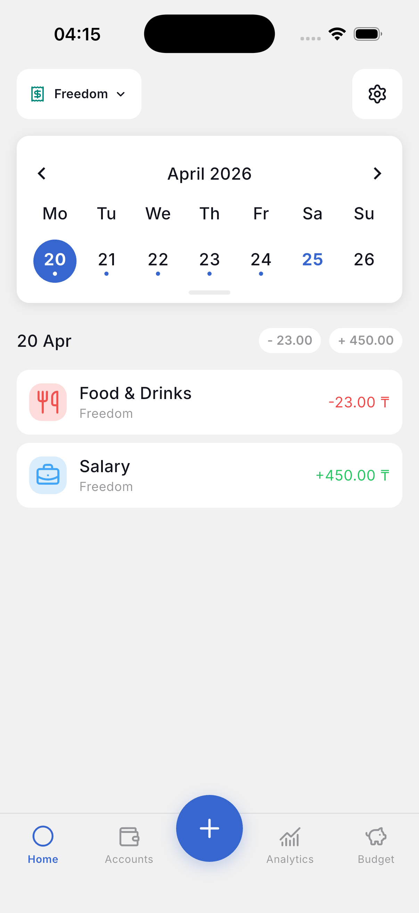
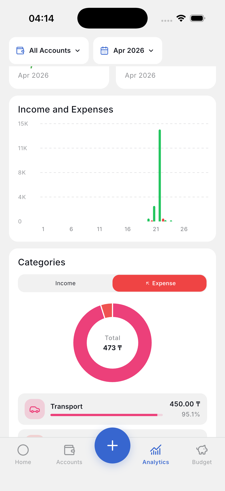
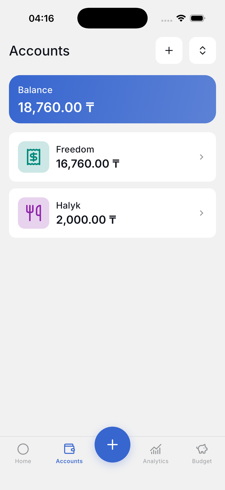
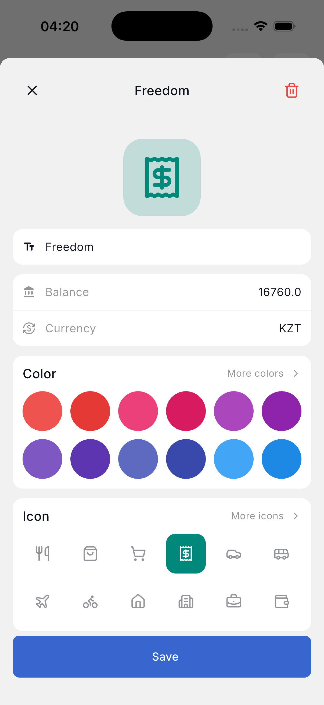
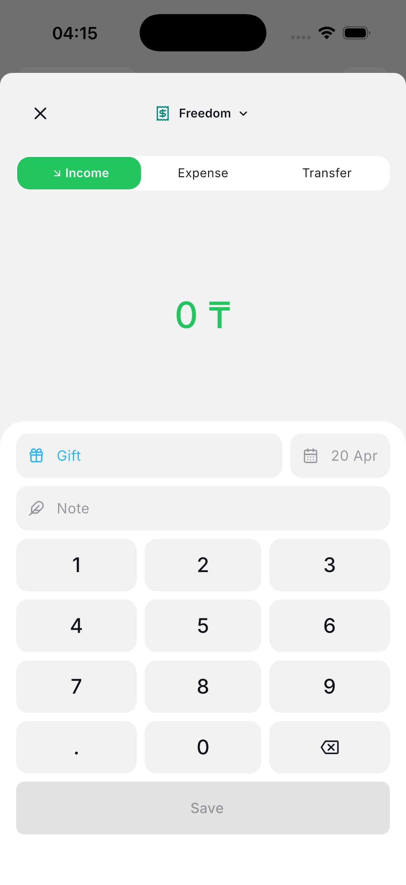
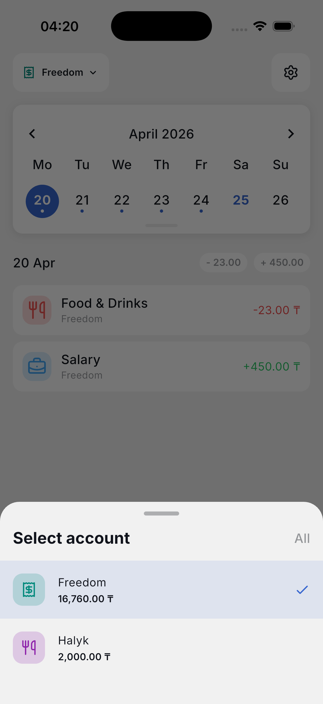
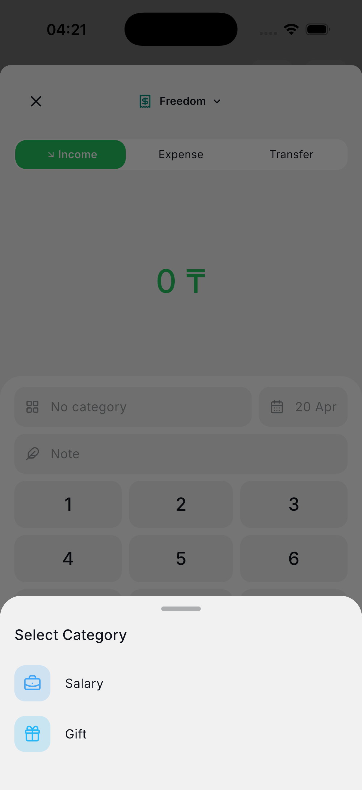
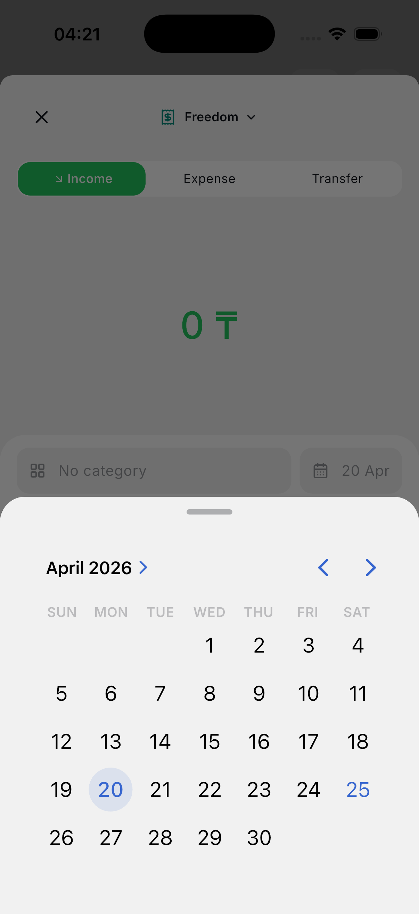
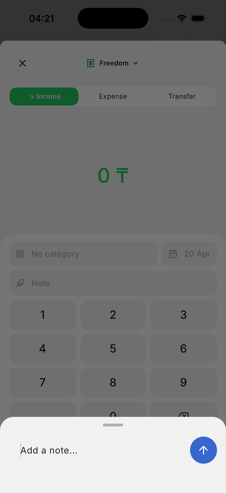
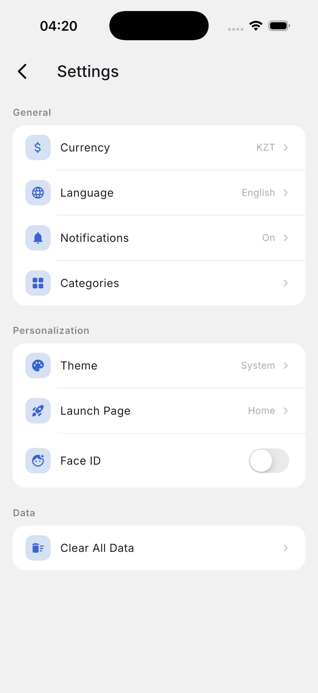

# WiseBudget

WiseBudget is a personal finance app built with Flutter for tracking income, expenses, transfers, accounts, budgets, and spending analytics in one place.

The project follows a feature-first architecture with `domain / data / presentation` separation, local-first persistence with ObjectBox, and a modular codebase designed to scale without turning state management into spaghetti.

## Overview

WiseBudget helps you:

- track income, expenses, transfers, and balance adjustments
- manage multiple accounts with their own currency, icon, and color
- organize transactions with custom categories
- monitor weekly, monthly, and custom budgets
- view analytics by period and category
- work with exchange rates and store transaction snapshots in base currency
- customize language, theme, currency, and launch page

## App Tour

WiseBudget covers the main personal finance workflow end to end: daily tracking, fast transaction entry, account management, and app customization. Below is a quick visual walkthrough of the current UI.

<table>
  <tr>
    <td align="center"><br /><sub><b>Home Overview</b></sub></td>
    <td align="center"><br /><sub><b>Analytics Overview</b></sub></td>
    <td align="center"><br /><sub><b>Accounts Overview</b></sub></td>
  </tr>
  <tr>
    <td align="center"><br /><sub><b>Account Form</b></sub></td>
    <td align="center"><br /><sub><b>Transaction Form</b></sub></td>
    <td align="center"><br /><sub><b>Select Account</b></sub></td>
  </tr>
  <tr>
    <td align="center"><br /><sub><b>Select Category</b></sub></td>
    <td align="center"><br /><sub><b>Pick Date</b></sub></td>
    <td align="center"><br /><sub><b>Add Note</b></sub></td>
  </tr>
  <tr>
    <td align="center"><br /><sub><b>Settings</b></sub></td>
    <td></td>
    <td></td>
  </tr>
</table>

## Features

### Accounts

- Create, edit, delete, and reorder accounts
- Store account name, currency, icon, color, and current balance
- Switch active account from the home screen
- Keep balances in sync with transactions

### Transactions

- Support for `income`, `expense`, `transfer`, and `adjustment`
- Create and edit transactions in bottom-sheet flows
- Store exchange-rate snapshot per transaction
- Keep transaction writes and balance updates consistent through an atomic ObjectBox-backed gateway

### Categories

- Custom categories with icon and color selection
- Default seeded categories on first launch
- Visibility control for hiding categories without deleting them

### Budgets

- Weekly, monthly, and custom-period budgets
- Budget progress, remaining amount, overspend state, and projections
- Budget overview built from domain-level computed models

### Analytics

- Income and expense summaries
- Period-based filtering
- Category breakdown
- Trend buckets for charts
- Category detail view with transaction breakdown

### Settings

- Light, dark, and system theme
- App language
- Default currency
- Launch page selection
- Clear all local data

## Architecture

The codebase is organized by feature and split into clear layers:

```text
lib/
├── core/
│   ├── app/
│   ├── constants/
│   ├── database/
│   ├── di/
│   ├── l10n/
│   ├── prefs/
│   ├── router/
│   ├── services/
│   ├── shared/
│   └── theme/
│
└── features/
    └── <feature>/
        ├── data/
        ├── domain/
        └── presentation/
```

### Principles used in the project

- Feature-first folder structure
- `domain / data / presentation` separation
- `Cubit` for presentation state
- `GetIt` for dependency injection
- Use-case oriented domain logic
- Local-first persistence with ObjectBox
- Atomic transaction and balance updates through a dedicated gateway
- Reusable shared UI components under `core/shared`

### Notable architecture decisions

- `AnalyticsCubit` and `BudgetCubit` are page-scoped instead of app-wide singletons
- Cross-feature business logic was moved out of cubits into domain use cases
- Transaction side effects are coordinated through `TransactionEffectsGateway`
- Account balance recalculation is handled outside UI state
- Business logic around reports and budget overview is covered by unit tests

## Tech Stack

| Area | Tools |
|---|---|
| Framework | Flutter |
| State management | `flutter_bloc` |
| Routing | `go_router` |
| Local storage | `ObjectBox` |
| Dependency injection | `get_it` |
| Networking | `dio` |
| Functional error handling | `dartz` |
| Localization | Flutter l10n + ARB |
| Charts | `fl_chart` |
| Icons | `lucide_icons_flutter` |
| Bottom sheets | `modal_bottom_sheet` |
| Menus | `pull_down_button`, `pie_menu` |

## Project Status

Current state:

- core finance flows are implemented
- architecture has been cleaned up and stabilized
- analyzer is clean
- unit tests exist for key extracted domain logic

Implemented test coverage includes:

- `BalanceService`
- analytics report builder
- budget overview builder

## Getting Started

### Requirements

- Flutter SDK `3.27+`
- Dart SDK compatible with the version in [pubspec.yaml](/Users/aslandossymzhan/development/Projects/wisebuget/pubspec.yaml:1)

### Install dependencies

```bash
flutter pub get
```

### Generate ObjectBox files

```bash
dart run build_runner build
```

### Run the app

```bash
flutter run
```

### Run static analysis

```bash
flutter analyze
```

### Run tests

```bash
flutter test
```

## Localization

The app includes localization support and is wired through Flutter's generated l10n pipeline.

Translations live in:

- `lib/core/l10n/app_en.arb`
- `lib/core/l10n/app_ru.arb`
- `lib/core/l10n/app_kk.arb`

## Main Dependencies

Some of the main packages used in the project:

- `flutter_bloc`
- `go_router`
- `objectbox`
- `objectbox_flutter_libs`
- `get_it`
- `dio`
- `equatable`
- `dartz`
- `fl_chart`
- `pull_down_button`
- `modal_bottom_sheet`

## Roadmap

Planned improvements:

- richer multi-currency UX
- recurring transactions
- export flows
- backup and restore
- biometric lock
- broader widget and integration test coverage
- tablet and larger-screen optimizations

## Development Notes

If you are working on the project locally:

- run `build_runner` after ObjectBox model changes
- keep feature logic in the domain layer when possible
- avoid cubit-to-cubit business dependencies
- prefer page-scoped state for screen-specific flows

## License

This project is currently private / unlicensed unless you explicitly add a license file.
