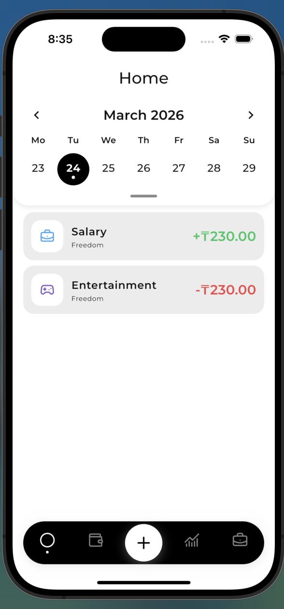
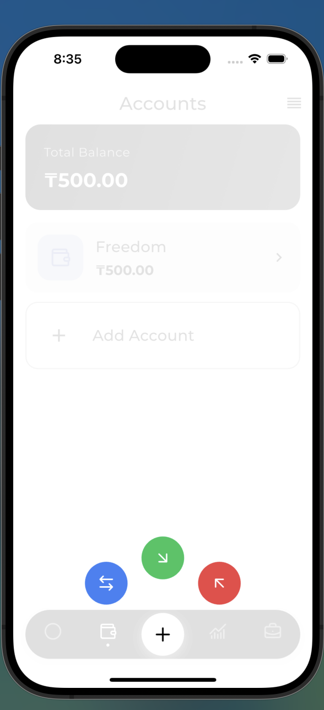
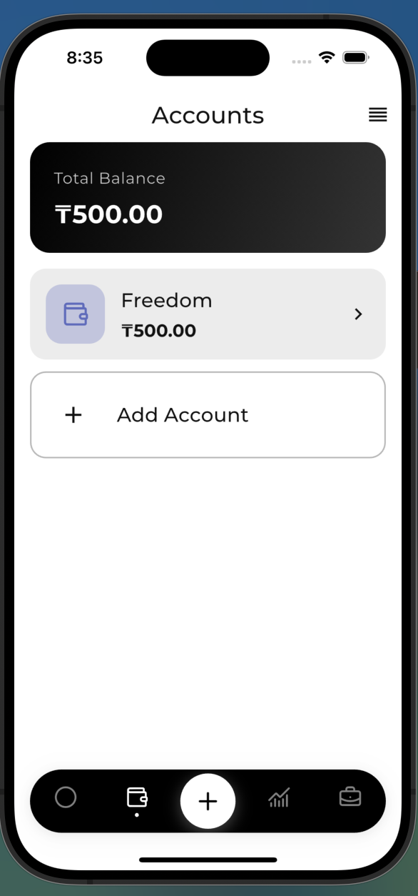
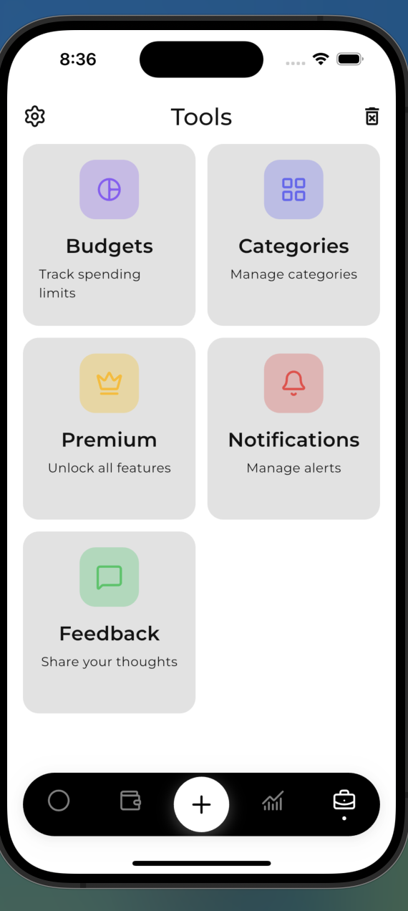

# WiseBudget

A personal finance management app built with Flutter. Track transactions, manage multiple accounts, categorize spending, and gain insights into your financial habits.

## Screenshots

| Home | Add Transaction |
|------|----------------|
|  |  |

| Accounts | Tools (Settings) |
|-----------|----------|
|  |  |

---

## What's Done

### Core
- **Clean Architecture** — feature-based modular structure with strict Domain / Data / Presentation separation
- **Dependency Injection** — GetIt service locator with lazy singletons; all features wired in `dependency_injection.dart`
- **Navigation** — GoRouter with typed routes, splash redirect guard, and `NoTransitionPage` for instant tab switches
- **Theming** — Material 3 with light/dark mode, custom `ThemeExtension` slots for `PieTheme` and `PullDownButtonTheme`
- **Localisation** — ARB-based l10n with Flutter's `generate: true` pipeline
- **Network layer** — Dio-based `NetworkService` singleton; single entry point for all HTTP calls

### Features

#### Accounts
- Create, edit, delete accounts with name, currency, icon, and color
- Balance auto-updated on every transaction create / edit / delete
- Account filter chip on the home screen

#### Transactions
- Income, Expense, Transfer, and Adjustment transaction types
- iOS Cupertino date picker (bottom sheet) for date selection
- Long-press context menu (edit / delete) on every transaction card
- Balance adjustment flow for correcting account balances

#### Categories
- Custom categories with icon and color picker
- Seeded defaults on first launch
- Visibility toggle (hide without deleting)

#### Budget
- Weekly, monthly, and custom-period budgets
- Filter by account and/or category
- Real-time progress: on track / near limit / exceeded states
- `BudgetProgress` computed entity (not persisted — derived at runtime)

#### Analytics
- Income/Expense summary cards at the top of the analytics tab
- Period selector (Day / Week / Month / Year / Custom range) via `PullDownButton`
- Bar chart trend view per category
- Category detail page with per-transaction breakdown

#### Exchange Rates
- `ExchangeRateEntity` — immutable historical rate snapshots
- `ExchangeRateRepository` with local (ObjectBox) + remote (Frankfurter API) sources
- `GetOrFetchExchangeRate` use case: local cache hit → stale check → network fetch → offline fallback
- Rate stamped on every transaction at save time (`exchangeRate`, `convertedAmount`, `baseCurrency`)
- `amountInBase` and `isCrossCurrency` getters on `TransactionEntity`

#### Settings
- Theme mode (light / dark / system)
- App language
- Default launch page
- **Currency picker** with live exchange rates per currency (open.er-api.com)
  - Info banner showing last update timestamp
  - Error banner with retry button on network failure
- Clear all data

### UI / UX
- `Pressable` widget with ripple effect used throughout
- `ColoredIconBox` for category/type icons
- `PickerField` — unified tap-to-open field component
- `PeriodChip` — pull-down menu for period selection
- `ModalSheet` / `showModal` — platform-adaptive bottom sheet (phone vs tablet)
- `AccountChip` — account switcher in the home app bar
- `Calendar` — custom horizontal date strip with transaction dot indicators

---

## What's Planned

### Multi-Currency Polish
- [ ] Show converted amount as secondary text on transaction cards when `isCrossCurrency`
- [ ] Display live rate chip in the transaction form ("1 USD ≈ 450 ₸") with stale warning
- [ ] Analytics aggregation using `convertedAmount` for cross-currency totals
- [ ] Budget progress using `convertedAmount` for cross-currency budgets
- [ ] "Recalculate historical rates" action in settings (batch re-snapshot)

### Transactions
- [ ] Recurring / scheduled transactions
- [ ] Transaction search and full-text filter
- [ ] Bulk delete

### Analytics
- [ ] Net worth over time chart
- [ ] Spending by merchant / payee tag
- [ ] Export to CSV / PDF

### Accounts
- [ ] Account reordering (drag-and-drop)
- [ ] Archive accounts without deleting history

### Budgets
- [ ] Budget rollover (carry unused balance to next period)
- [ ] Push notifications when approaching / exceeding a budget

### Settings & Infrastructure
- [ ] iCloud / Google Drive backup and restore
- [ ] Biometric app lock
- [ ] Widget (home screen balance summary)
- [ ] iPad / tablet layout optimisation
- [ ] Full unit and widget test coverage

---

## Tech Stack

| Layer | Library |
|---|---|
| UI | Flutter, Material 3 |
| State management | flutter_bloc (Cubit) |
| Navigation | go_router |
| Local database | ObjectBox |
| Dependency injection | get_it |
| Networking | Dio |
| Charts | fl_chart |
| Icons | lucide_icons_flutter |
| Date picker | cupertino_calendar_picker |
| Context menus | pull_down_button |

---

## Getting Started

### Prerequisites

- Flutter SDK 3.27+
- Dart 3.6+

### Installation

```bash
# Clone the repository
git clone https://github.com/yourusername/wisebuget.git
cd wisebuget

# Install dependencies
flutter pub get

# Generate ObjectBox models
dart run build_runner build

# Run the app
flutter run
```

## Architecture

```
lib/
├── core/
│   ├── di/            # GetIt wiring
│   ├── router/        # GoRouter config
│   ├── services/      # NetworkService (Dio)
│   ├── prefs/         # SharedPreferences wrapper
│   ├── shared/        # Value objects, widgets, utils
│   └── theme/         # Material 3 theme + extensions
│
└── features/
    └── <feature>/
        ├── domain/    # Entities, repository interfaces, use cases
        ├── data/      # ObjectBox models, data sources, repo implementations
        └── presentation/  # Cubits, pages, widgets
```
